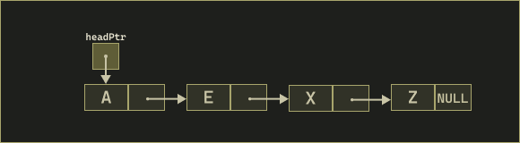

## Streams

**Streams** are sequences of bytes used for input and output.

- **Input**: Data flows _from_ a device (keyboard, disk, network, etc.) _into_ main memory.
- **Output**: Data flows _from_ main memory _to_ a device (screen, printer, disk, network, etc.).

At program start, three standard streams are available (which can be *redirected* to other devices or files):

1. Standard input (`stdin`) – usually from the keyboard.
2. Standard output (`stdout`) – usually to the screen.
3. Standard error (`stderr`) – also to the screen, for error messages.

---
## printf

### Conversion Specifiers

`printf` uses **conversion specifiers** to determine how data is formatted when printed. Each specifier begins with `%` followed by one or more characters describing type and formatting.

| Specifier                                            | Description                                               | Example Output                           |
| ---------------------------------------------------- | --------------------------------------------------------- | ---------------------------------------- |
| **Integers**                                         |                                                           |                                          |
| `%d`, `%i`                                           | Signed decimal integer                                    | `printf("%d", 42)` → `42`                |
| `%u`                                                 | Unsigned decimal integer                                  | `printf("%u", 42)` → `42`                |
| `%o`                                                 | Unsigned octal integer                                    | `printf("%o", 10)` → `12`                |
| `%x`, `%X`                                           | Unsigned hexadecimal integer (`a–f` or `A–F`)             | `printf("%x", 255)` → `ff`               |
| **Floating-point**                                   |                                                           |                                          |
| `%f`\*                                               | Floating-point decimal (fixed)                            | `printf("%f", 3.1416)` → `3.141600`      |
| `%e`, `%E`\*                                         | Floating-point in scientific notation                     | `printf("%e", 1234.56)` → `1.234560e+03` |
| `%g`, `%G`\*\*                                       | Floating-point (shortest of `%f` or `%e`)                 | `printf("%g", 0.0000123)` → `1.23e-05`   |
| \* default 6 digits of precision after decimal       |                                                           |                                          |
| \*\* 6 significant digits (including before decimal) |                                                           |                                          |
| **Characters & Strings**                             |                                                           |                                          |
| `%c`                                                 | Single character                                          | `printf("%c", 'A')` → `A`                |
| `%s`                                                 | String of characters                                      | `printf("%s", "Hello")` → `Hello`        |
| **Miscellaneous**                                    |                                                           |                                          |
| `%p`                                                 | Pointer displayed in an **implementation defined manner** | `printf("%p", ptr)` → `0x7ffeefbff5ac`   |
| `%%`                                                 | Prints a literal percent sign                             | `printf("%%")` → `%`                     |

---

#### When to Use `%g`

The `%g` (or `%G`) specifier automatically chooses between **fixed-point (`%f`)** and **scientific (`%e`)** notation depending on the value’s magnitude and precision:

- If the exponent is less than -4 or greater than or equal to the precision, `%e` format is used.
- Otherwise, `%f` format is used.
- Trailing zeros are **removed**, and no unnecessary decimal point is shown.

```c
printf("%g", 0.0000123); // → 1.23e-05
printf("%g", 123.456);   // → 123.456
printf("%g", 100.0);     // → 100
```

Use `%g` when you want **concise output** without manually deciding between scientific and decimal notation.

---
### Field Widths

A **field width** specifies the **minimum number of characters** to print. If the value is shorter, it is **right-padded with spaces** by default.

```c
printf("%5d", 12);         // "   12" (width = 5)
printf("%5d\n", 123456);   // "123456" (wider than specifier, prints fully)
printf("%-5d", 12);        // "12   " (left-justified)
```

Field widths can also apply to floating-point values:

```c
printf("%8.2f", 3.14); // "    3.14"
```

- The number before the decimal controls total width.
- The number after the decimal controls precision.

---
### Flags

Flags modify alignment, padding, and sign display in formatted output.

| Flag  | Meaning                                                                 | Example                        |
| ----- | ----------------------------------------------------------------------- | ------------------------------ |
| `-`   | Left-justify within the field                                           | `printf("%-5d", 42)` → `42   ` |
| `+`   | Always print a sign (`+` or `-`)                                        | `printf("%+d", 42)` → `+42`    |
| space | Prefix positive numbers with a space                                    | `printf("% d", 42)` → ` 42`    |
| `0`   | Pad numeric output with leading zeros                                   | `printf("%05d", 42)` → `00042` |
| `#`   | Force alternate form (e.g., add `0x` for hex, decimal point for floats) | `printf("%#x", 255)` → `0xff`  |

---
<div class="page-break"></div>

## scanf

---
### Conversion Specifiers

| Specifier                          | Description                                                  |     |
| ---------------------------------- | ------------------------------------------------------------ | --- |
| **Integers**                       |                                                              |     |
| `%d`                               | Reads a signed decimal integer `int*`                        |     |
| `%i`                               | Reads signed decimal, octal, or hexadecimal `int*`           |     |
| `%o`                               | Reads an octal integer `unsigned int*`                       |     |
| `%u`                               | Reads an unsigned decimal integer `unsigned int*`            |     |
| `%x` / `%X`                        | Reads a hexadecimal integer `unsigned int*`                  |     |
| `h`, `l`, `ll`                     | Length modifiers (`short`, `long`, `long long`) for integers |     |
| **Floating-point**                 |                                                              |     |
| `%e`, `%E`, `%f`, `%F`, `%g`, `%G` | Reads a floating-point value `float*` / `double*`            |     |
| `l` or `L`                         | Length modifiers for `double` or `long double`               |     |
| **Characters & Strings**           |                                                              |     |
| `%c`                               | Reads a single character `char*` (no `\0` added)             |     |
| `%s`                               | Reads a string `char[]` (terminates with `\0`)               |     |
| **Scan set**                       |                                                              |     |
| `%[...]`                           | Reads a set of characters into a string                      |     |
| **Miscellaneous**                  |                                                              |     |
| `%p`                               | Reads an address (pointer format)                            |     |
| `%n`                               | Stores number of characters read so far `int*`               |     |
| `%%`                               | Skips a literal `%` in input                                 |     |

---

### Scan Sets and Inverted Scan Sets

**Scan sets** allow `scanf` to read a group of characters that match a specified set. They are defined using `%[ ... ]`.

- `%[characters]` → reads only the characters listed.
- `%[^characters]` → reads everything _except_ the characters listed.
- Useful for reading structured data such as comma- or space-separated values.

```c
char word[20];
scanf("%19[A-Za-z]", word);   // reads only letters

char untilComma[30];
scanf("%29[^,]", untilComma);  // reads everything up to the next comma
```

**Notes:**

- `scanf` automatically adds a null terminator (`'\0'`) at the end.
- To include `]` in the scanset, place it first inside the brackets: `%[]A-Z]`.
- To include `-`, place it at the start or end of the set: `%[-A-Z]`.

---
### Field Widths

Field widths define how many characters `scanf` will read for a given conversion. This prevents buffer overflows and controls input precision.

```c
char name[11];
scanf("%10s", name);   // reads at most 10 chars, leaves space for null terminator
```

```c
int year, month, day;
scanf("%4d%2d%2d", &year, &month, &day);
// Input: 20251028 → year=2025, month=10, day=28
```
<hr>

### Skipping Characters and Assignment Suppression

The **assignment suppression character** (`*`) allows `scanf` to skip matched input without storing it.

- Any literal in the format string must appear in the input and will be consumed.
- Whitespace in the format matches any amount of whitespace in the input.

```c
// Skip a single character (like '-') between numbers
int year, month, day;
scanf("%d%*c%d%*c%d", &year, &month, &day);

// Skip entire field before comma
char name[20];
scanf("%*[^,],%19s", name);
```

---
## Formatted I/O Variants

| Function                                           | Purpose                                       | Typical Use Case                        |
| -------------------------------------------------- | --------------------------------------------- | --------------------------------------- |
| `fprintf(FILE *fp, const char *format, ...)`       | Prints formatted output to a file stream.     | Writing data to files.                  |
| `fscanf(FILE *fp, const char *format, ...)`        | Reads formatted input from a file stream.     | Reading structured file input.          |
| `sprintf(char *str, const char *format, ...)`      | Writes formatted output into a string buffer. | Building formatted strings in memory.   |
| `sscanf(const char *str, const char *format, ...)` | Reads formatted input from a string.          | Parsing string data (e.g., CSV fields). |

!!! tip "Formatted I/O Variant Use"

    These functions behave like `printf` and `scanf`, but redirect input/output to files or strings instead of the console.

---
## Literals and Escape Sequences

Characters in a format string that are not part of a conversion specification are printed literally.

Escape sequences allow you to include special characters in strings that cannot be typed directly or would otherwise be ambiguous.

| Escape | Description                                                     |
| ------ | --------------------------------------------------------------- |
| `\'`   | Single quote (`'`)                                              |
| `\"`   | Double quote (`"`)                                              |
| `\?`   | Question mark (`?`)                                             |
| `\\`   | Backslash (`\\`)                                                |
| `\a`   | Alert (bell/flash)                                              |
| `\b`   | Backspace                                                       |
| `\f`   | Form feed (new page)                                            |
| `\n`   | Newline                                                         |
| `\r`   | Carriage return (does **_not_** move to beginning of next line) |
| `\t`   | Horizontal tab                                                  |
| `\v`   | Vertical tab                                                    |
| `%%`   | Percent symbol (`%`)                                            |

---
## Recursion

**Recursion** occurs when a function calls itself directly or indirectly. Each call creates a new stack frame until a **base case** is reached, after which calls resolve in reverse order.

- **Base Case:** The simplest form of the problem that can be solved directly.
- **Recursive Case:** Reduces the problem toward the base case.
- Recursion always requires _progress toward termination_ to prevent infinite loops.


```c
int factorial(int n)
{
    if (n == 0)  // base case
        return 1;
    else          // recursive case
        return n * factorial(n - 1);
}
```

- For `factorial(3)` → calls unfold as `3 * factorial(2)` → `2 * factorial(1)` → `1 * factorial(0)`.
- Base case returns 1, then each call multiplies by the previous `n` until the result is complete.

---
<div class="page-break"></div>

## Structures

A **structure** groups related variables under one name. The C standard calls them _aggregates_.
Defined using the `struct` keyword:

```c
struct card {
    const char *face;
    const char *suit;
};
```

Semicolon is required after the closing brace. Members can be of different types, but a structure cannot directly contain an instance of itself—only a pointer to its own type.

```c
struct card {
    const char *face;
    const char *suit;
    struct card *nextCard;  // Valid
};
```

---
### Defining Variables of Structure Types

Defining a structure creates a **type**, not a variable.
Variables are declared afterward:

```c
struct card myCard;
struct card deck[52];
struct card *cardPtr;
```

You can also define variables inline with the structure:

```c
struct card {
    const char *face;
    const char *suit;
} myCard, deck[52], *cardPtr;
```

---
### Initializing Structures

  ```c
  // array-like member initializer lists
  struct card K = {"king", "clubs"};

  // assigning values to individual data members
  struct card Q;
  Q.face = "queen";
  Q.suit = "spades";

  // assignment statements (setting one variable to equal another of the same struct)
  struct card A = {"Ace", "Hearts"};
  struct card B;

  B = A;   // assignment statement
  ```

---
### Accessing Members of a Structure

You can access members of a structure using the **structure member operator**:
`.`

```c
struct card K = {"king", "clubs"};`
char *Kface = K.face;
```

If you are referring to the structure through a pointer, you can use the
**structure arrow operator** to access the members.

```c
struct card *KPtr = &K;
char *Kface = K->face;

// Alternatively you can also use the following dereference and dot syntax
char *Ksuit = (*KPtr).suit; // note the paranthesis are *required* here.
```

---
### Structures Without Tag Names

Anonymous structs can be declared if variables are defined immediately:

```c
struct {
    int x;
    int y;
} point1, point2;
```

Without a tag, you can’t reuse the type elsewhere.

---
### Comparing Structure Objects

Structures cannot be compared with `==` or `!=` because compilers insert
**padding bytes** for memory alignment, which may hold **unspecified garbage
values**.

Even identical structures might differ in padding, making bytewise comparison
**undefined behaviour**.

With that said, they could **_sometimes_** compare equally (although as noted
it is undefined behaviour and can't be relied on).

---
### Using `sizeof` with Structures

`sizeof(struct_name)` gives the memory occupied by a structure, including padding.

```c
struct example {
    char c;
    int i;
};

printf("%zu\n", sizeof(struct example)); // Likely prints 8, not 5
```
<div class="page-break"></div>

---
### Passing Structures and Arrays

**Array of structures:** passed **by reference** (actually decays to a pointer), just like any other array.

  - The function can modify the original elements.

**Array member inside a structure:** passed **by value** when the structure itself is passed by value.

  - The function receives a copy; modifying it won’t affect the original.

---
## typedef

`typedef` creates an alias for a type, making code more concise and readable.

```c
typedef struct card Card;
Card newCard;
```

---
### Combining `typedef` with `struct`

You can combine both in one declaration:

```c
typedef struct {
    const char *face;
    const char *suit;
} Card;
```

!!! warning

    Do not declare variables in the same line when using this form.
    If you need variables too, use a standard `struct` definition followed by a separate `typedef`.

---
## Unions

A **union** is a derived data type similar to a `struct`, but unlike structures,
**all members share the same memory space**. Only one member can be used at a
time, making unions memory-efficient when variables are only relevant at different
times during execution.

```c
union number {
    int x;
    double y;
};
```

Defining a union creates a new type but does not allocate memory until a variable is declared.

- The **size** of a union equals the size of its **largest member**.
- Accessing a member different from the one last assigned leads to undefined behavior.
- Unions save space but require careful type management.

### Initializing a Union

A union can be initialized only through its **first member**:

```c
union number value = {10}; // assigns 10 to x
```

!!! warning

    If initialized with a value meant for another member, it will be converted to the first member’s type:

    ```c
    union number value = {1.43}; // assigns 1 to x instead of 1.43 to y
    ```

---

## Bitwise Operators

Bitwise operations work directly on the binary representation of integer types
such as short, int, and long (and their unsigned variants). Each bit in a
value represents a power of two. 

!!! abstract "Operators"
    <div class="grid cards print-3" markdown>
    
    -   **AND `&`**  
        Sets a bit to 1 **only if both bits are 1**.
    
        ```c
        // 1101 (13)
        // 1011 (11)
        // ----
        // 1001 (9)
        ```
    
    -   **OR `|`**  
        Sets a bit to 1 **if either bit is 1**.
    
        ```c
        // 1101 (13)
        // 1011 (11)
        // ----
        // 1111 (15)
        ```
    
    -   **XOR `^`**  
        Sets a bit to 1 **if bits differ**.
    
        ```c
        // 1101 (13)
        // 1011 (11)
        // ----
        // 0110 (6)
        ```
    
    -   **NOT `~`**  
        Inverts each bit.
    
        ```c
        // 0101 (5)
        // ~
        // ----
        // 1010 (10)    
        ```
        shown as 4 bits
    
    -   **Left shift `<<`**  
        Moves bits **left** (fills with 0). 
    
        ```c
        // 0101 (5) 
        // << 1  
        // ----
        // 1010 (10)
        ```
        Each shift multiplies by 2.
    
    -   **Right shift `>>`**  
        Moves bits **right** (fills with 0).
    
        ```c
        // 1010 (10) 
        // >> 1  
        // ---- 
        //0101 (5)
        ```
        Each shift divides by 2.
    </div>

    **Note on shifts**: Right-shift of **signed** negative values is
    implementation-defined; use `unsigned` integers where possible.


???+ tip "Common bit manipulation patterns"
     **Even/odd**: `x & 1`  
      ```c
      if (x & 1) puts("Odd"); else puts("Even");
      ```
     **Swap without temp** (XOR-swap):  
      ```c
      a ^= b; b ^= a; a ^= b;
      ```
     **Power of two** (exactly one bit set):  
      ```c
      if (x > 0 && (x & (x - 1)) == 0) puts("Power of 2");
      ```
     **Count set bits** (Kernighan):  
      ```c
      int c = 0; for (; x; ++c) x &= (x - 1);
      ```
     **Set / clear / toggle bit n**:  
      ```c
      x |=  (1u << n);   // set
      x &= ~(1u << n);   // clear
      x ^=  (1u << n);   // toggle
      ```
     **Lowest set bit**:  
      ```c
      unsigned lowest = x & -x;
      ```
     **Opposite signs**:  
      ```c
      if ((x ^ y) < 0) puts("Opposite signs");
      ```

<div class="page-break"></div>

---
## Enums

An enumeration is a user-defined type consisting of a set of named integer constants.
<br>Identifiers must be unique, but they can share the same constant value.

```c
enum Day { MON, TUE, WED, THU, FRI, SAT, SUN }; // identifiers (MON–SUN) map to constants 0–6
enum Day today = WED; // WED corresponds to 2

// You can also specify constant values in the definition
enum SomeDays { MON = 1, TUE = 3, WED = 1 }; // WED shares the same value as MON

// You **cannot** assign to enum constants after definition
WED = 4;  // <- ERROR: enumeration constants are read-only (compile-time error)
```

---
## Self-Referential Structures

- Structures can include **pointers to their own type**, enabling dynamic data structures.

  ```c
  struct node { int data; struct node *nextPtr; };
  ```

- Used for **linked lists**, **stacks**, and **trees**.


---
## Linked Lists

**Linear collection** of nodes connected by pointers.

- Each node contains **data** and a **pointer to the next node**.
- The **head pointer** references the first node; the last node’s pointer is `NULL`.




| Arrays               | Linked Lists            |
| :------------------- | :---------------------- |
| Fixed size           | Dynamic size            |
| O(1) direct access   | Sequential traversal    |
| Costly insert/delete | Efficient insert/delete |


| Operation    | Description                               |
| :----------- | :---------------------------------------- |
| **Insert**   | Allocate a new node and relink pointers.  |
| **Delete**   | Relink surrounding nodes and free memory. |
| **Traverse** | Follow `nextPtr` until `NULL`.            |

---

## Stacks

A **stack** is a linear data structure that follows the **Last-In, First-Out (LIFO)** principle. The most recently added element is removed first.

- Insertion and deletion occur only at the **top** of the stack.
- Implemented using **linked lists** or **arrays**.
- The **stack pointer** (`topPtr`) tracks the current top node.

| Operation     | Description                                  |
| :------------ | :------------------------------------------- |
| **push()**    | Insert an element at the top.                |
| **pop()**     | Remove the top element and return its value. |
| **isEmpty()** | Check if the stack is empty.                 |


```c
struct stackNode {
    int data;
    struct stackNode *nextPtr;
};
```

---
## Queues

A **queue** is a linear data structure that follows the **First-In, First-Out (FIFO)** principle. The first element added is the first one removed.

- Insertion occurs at the **rear**; deletion occurs at the **front**.
- Implemented using **linked lists**.
- Two pointers are used:

    - `frontPtr` → points to the first node
    - `rearPtr` → points to the last node

| Operation     | Description                       |
| :------------ | :-------------------------------- |
| **enqueue()** | Add a new element to the rear.    |
| **dequeue()** | Remove an element from the front. |
| **isEmpty()** | Check if the queue is empty.      |


```c
struct queueNode {
    int data;
    struct queueNode *nextPtr;
};
```

<div class="page-break"></div>

---

## Trees

**Non-linear hierarchical** data structure consisting of **nodes** connected by edges.

- Each node may have **two or more** children.

### Binary Trees

A type of tree where each node has at most **two children** (`left`, `right`).

- The **root** is the topmost node; **leaf** nodes have no children.


### Binary Search Tree (BST)

Special binary tree where:

  - Left subtree value **<** Root value **<** Right subtree value.
  - Enables fast searching, insertion, and deletion.


### Tree Traversals

| Type          | Visit Order         | Common Use             |
| :------------ | :------------------ | :--------------------- |
| **Preorder**  | Root → Left → Right | Copying the tree       |
| **Inorder**   | Left → Root → Right | Produces sorted output |
| **Postorder** | Left → Right → Root | Deletion or cleanup    |

---
### Pointer-to-Pointer

When a function needs to **modify a pointer** (such as a tree’s root or a linked list’s head), it must receive the **address of that pointer**. This allows the function to update the caller’s pointer directly.

```c
void insertNode(TreeNodePtr *treePtr, int value)
{
    if (*treePtr == NULL) {
        *treePtr = malloc(sizeof **treePtr);
        (*treePtr)->data = value;
        (*treePtr)->leftPtr = NULL;
        (*treePtr)->rightPtr = NULL;
    }
    else if (value < (*treePtr)->data)
        insertNode(&((*treePtr)->leftPtr), value);  // pass address of left child
    else if (value > (*treePtr)->data)
        insertNode(&((*treePtr)->rightPtr), value); // pass address of right child
}
```

- `treePtr` is a **pointer to a pointer** (`TreeNode **`).
- `*treePtr` gives the **actual node pointer** (e.g., the root or a child link).
- `&((*treePtr)->leftPtr)` passes the **address of the child pointer**, allowing recursion to modify that link directly.

Use `(*ptr)->member` instead of confusing forms like `*(*ptr).member`. Parentheses ensure the dereference applies to the pointer, not the struct member.
