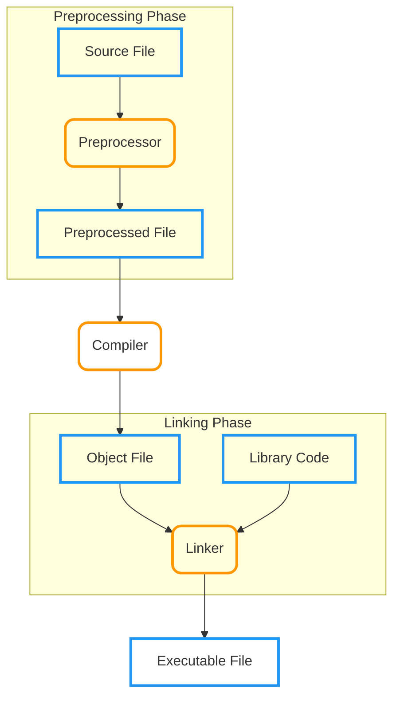

# Week 11

This week covers the **C preprocessor**, **conditional compilation**, and the
basics of **multi-file programs**. 

---

## The C Preprocessor

The **C Preprocessor** is a program that processes the source code before it is
passed to the compiler. Its main functions are:

- **Inclusion** of other files.
- **Definition** of symbolic constants and macros.
- **Conditional compilation** of program code.
- Conditional execution of preprocessor directives.

Preprocessor directives always begin with a hash sign (`#`) and can only have
whitespace characters before them on a line.

### The Build Process

The preprocessor is the first step in converting a source file to an executable.



---

## `#include` Directive

The `#include` directive causes a copy of the specified file to be included in
place of the directive itself. This is typically used to incorporate **header
files** that contain common declarations like function prototypes and `struct`
definitions.

| Format                    | Search Location                                                | Usage                           |
| :------------------------ | :------------------------------------------------------------- | :------------------------------ |
| **`#include <filename>`** | Searches **standard library** for the file.                    | Use for standard library files. |
| **`#include "filename"`** | Searches the **current directory**, then the standard library. | Use for user-defined files.     |

---

## `#define` and Macros

The `#define` directive is used to create **symbolic constants** and
**macros**.

### Symbolic Constants

When the program is compiled, all occurrences of the symbolic constant are
replaced with the replacement text. Once a symbolic constant is created, it
**cannot be redefined**.

```c
// Format: #define identifier replacement-text
#define PI 3.14159
```

### Macros with Arguments

A **macro** is an operation defined in a `#define` directive. A macro with
arguments has its arguments substituted for the replacement text when the macro
is expanded. Macros perform a **text substitution**, meaning **no data type
checking** is performed. A macro without arguments is treated like a symbolic
constant.

!!! abstract "Macros vs. Functions"
    A macro performs a **text substitution** and does **no data type
    checking**, unlike functions.

???+ Example "Area Macro and the Importance of Parentheses"
    Always use parentheses around arguments and the entire macro body to avoid potential precedence issues after substitution.
    
    ```c
    #define PI 3.14159
    int c = 2;
    double area;

    // --- FAILURE: Missing Parentheses ---
    #define CIRCLE_AREA(x) PI * x * x

    area = CIRCLE_AREA(c + 2);
    // Expansion: area = 3.14159 * c + 2 * c + 2; 
    // Logic:     (3.14159 * 2) + (2 * 2) + 2
    // Result:    12.28318 (Incorrect)

    #undef CIRCLE_AREA // Undefine the macro so we can redefine it

    // --- SUCCESS: Correct Parentheses ---
    #define CIRCLE_AREA(x) (PI * (x) * (x))

    area = CIRCLE_AREA(c + 2);
    // Expansion: area = (3.14159 * (c + 2) * (c + 2));
    // Logic:     3.14159 * 4 * 4
    // Result:    50.26544 (Correct)
    ```        

### `#undef` 

- **`#undef`**: Undefines a symbolic constant or macro. If undefined, it can
  later be redefined.

---

## Conditional Compilation

**Conditional compilation** is used to control which parts of the program code
or which preprocessor directives are included or excluded before compilation.
The structure is similar to the `if` statement in C.

---

### Directives

Every starting `#if`, `#ifdef`, or `#ifndef` must end with an `#endif`.

| Directive                     | Equivalent           | Purpose                                                |
| :---------------------------- | :------------------- | :----------------------------------------------------- |
| **`#if**` constant-expression |                      | Compiles the block if the expression is non-zero.      |
| **`#ifdef**` name             | `#if defined(name)`  | Compiles the block if the name is defined.             |
| **`#ifndef**` name            | `#if !defined(name)` | Compiles the block if the name is **not** defined.     |
| **`#else`**                   |                      | Alternative block if the preceding condition is false. |
| **`#elif`**                   |                      | Else-if condition for checking multiple conditions.    |

!!! info "Note on Evaluation"
    Preprocessor directives cannot evaluate complex expressions like `sizeof`,
    cast expressions, or enumeration constants.

???+ Example "Header Guards (Preventing Multiple Inclusion)"
    This pattern ensures a header file's contents are only processed once,
    preventing redefinition errors when the header is included in multiple source
    files.

    ```c
    #ifndef MY_HEADER_H
    #define MY_HEADER_H

    // ... contents of the header file

    #endif
    ```

---

### Debugging with Conditional Compilation

A frequent use case is enabling or disabling debug code.

```c
#define DEBUG // Define DEBUG to enable the code block below.

// ... some program logic

#ifdef DEBUG
    // This code only compiles if DEBUG is defined
    printf("DEBUG: Variable x = %d\n", x);
#endif

// ... more program logic
```

To turn off the debug statements, simply remove or comment out the initial
`#define DEBUG`. The debugging statements are then ignored by the compiler.

---

## Multi-Source File Programs

Large programs are often split across multiple source files. A function
definition must exist entirely within one file (it cannot be split across
files), but it can be called from others.

### Sharing Global Variables: `extern`

Global variables are accessible to functions within the same file by default.
To use a global variable defined in one file in a _different_ file, you must
use the `extern` keyword.

- **`extern`**: Declares that a variable is defined in another file (External
  Linkage).
- **Function Prototypes**: Can be used in other files without an `extern`
  statement; you simply need a prototype in each file that uses the function
  (usually via a header file).

???+ Example "Using `extern` vs `static`"

    **File 1 (`one.c`)**
    ```c
    extern int value; // DECLARATION: Refers to 'value' defined in two.c
    int val2;         // DEFINITION: Global variable with external linkage

    int main() {
        // ...
    }
    ```

    **File 2 (`two.c`)**
    ```c
    int value;        // DEFINITION: The actual storage for 'value'
    static int val2;  // DEFINITION: Global variable with INTERNAL linkage
                      // (only visible in two.c)
    ```

### Limiting Scope: `static` Keyword

When the **`static`** keyword is used outside of all functions (at file scope),
it specifies that the variable or function has **internal linkage**. This means
it can only be used in the file in which it is defined, effectively hiding it
from other source files.

### Compiling Multi-File Programs

Compiling every file in a large project is tedious if small changes have been
made to only one file.

- **Make Utility**: On UNIX systems, the `make` utility is used to manage
  multi-file projects. It checks timestamps and recompiles only the files that
  have changed, linking them with the existing object files.

---

## Storage Classes

The **storage class** of a variable determines three key properties:

1.  **Duration (Lifetime)**: When the variable is created and destroyed.
2.  **Scope**: Where the variable can be referenced.
3.  **Linkage**: Whether the variable is accessible across multiple files.

| Storage Class        | Duration  | Scope | Linkage  | Declaration Location                         |
| :------------------- | :-------- | :---- | :------- | :------------------------------------------- |
| **`automatic`**      | Automatic | Block | None     | In a block (keyword `auto` is optional).     |
| **`register`**       | Automatic | Block | None     | In a block with keyword `register`.          |
| **`static`** (Block) | Static    | Block | None     | In a block with keyword `static`.            |
| **`static`** (File)  | Static    | File  | Internal | Outside all functions with keyword `static`. |
| **`extern`**         | Static    | File  | External | Outside all functions (implied or explicit). |
