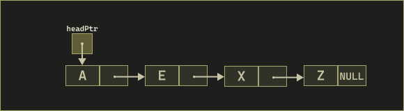
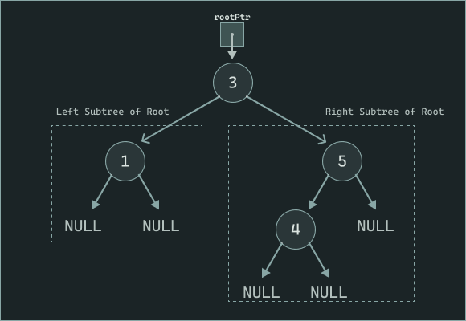
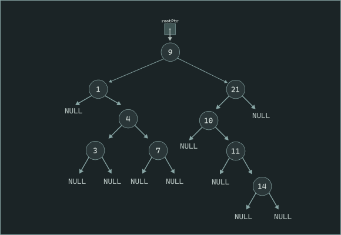

# Week 5

This week was an introduction to self-referential structures, linked lists, and
trees.

## Self-Referential Structures

A structure cannot contain a member of _its own type_ directly, because this
would require the compiler to know the full size of the structure before its
layout is complete. However, a structure **can** contain a pointer to its own
type. This allows structures to reference other structures of the same type.

This pattern is called a **self-referential structure**.

### Nodes

A **node** is a fundamental building block used in several data structures
(including linked lists, stacks, queues, and trees). A node stores its own data
and one or more pointers that describe how to reach other nodes.

Because these pointers refer to other nodes of the _same type_, nodes are
self-referential.

```c
struct node
{
    int data;
    struct node *nextPtr;
};
```

### Linked Lists

A **linked list** is a linear collection of self-referential **nodes** connected
by pointer links.

Unlike an array, a linked list does not require contiguous memory. Each node is
allocated separately, and each node stores:

- Its **data**
- A pointer to the **next** node in the list (`nextPtr`)

The list is accessed through a pointer to the **first node**, commonly called
the **head**. If the list is empty, the head pointer is set to `NULL`.

```c
struct node
{
    int data;
    struct node *nextPtr;
};
```



The last node in the list has a `nextPtr` of `NULL`, indicating that no further
nodes follow.

#### Traversing a Linked List

To process each element, we use a pointer that starts at the head and moves from
node to node until `NULL` is reached.

```c
struct node *current = head;

while (current != NULL)
{
    printf("%d ", current->data);
    current = current->nextPtr;
}
```

#### Arrays vs Linked Lists

Both arrays and linked lists store collections of data, but they differ in how
memory is managed and how elements are accessed.

##### When Linked Lists Are Useful

- A **linked list** is appropriate when the number of data items is **unknown
  or changes over time**.
- Linked lists are **dynamic**: nodes can be added or removed as needed at
  runtime.
- Useful when elements will be frequently **inserted or deleted**, especially
  in the **middle** of the sequence.

##### When Arrays Are Useful

- Arrays are **fixed-size** data structures. The size is determined when the
  array is created.
- Arrays allow direct (constant-time) access to **_any_** element because
  elements are stored **contiguously** in memory.
- Best when the total number of elements is **known in advance** and **fast
  indexing** is required.

##### Memory Considerations

- Arrays may reserve **more space than needed** if sized too large.
- Linked lists only use memory for the nodes currently stored, but **each node
  requires extra memory for a pointer**, and dynamic allocation involves
  overhead.

##### Performance Summary

| Operation / Property    | Array                         | Linked List                        |
| ----------------------- | ----------------------------- | ---------------------------------- |
| Size                    | Fixed at creation             | Grows and shrinks dynamically      |
| Memory Layout           | Contiguous                    | Distributed (each node separately) |
| Access by Index         | O(1) direct access            | O(n) traversal                     |
| Insert/Delete at Middle | Potentially expensive (shift) | Efficient with pointer adjustments |
| Extra Memory Required   | Only for elements             | Pointer stored in each node        |

#### Inserting into a Linked List

There are two common cases for inserting a new node into a singly linked list:

1. When the list **does not need to maintain sorted order** (unsorted insertion)
2. When the list **must remain sorted** after insertion (sorted insertion)

---

##### 1. Insertion in an Unsorted List

The simplest approach is to insert the new node **at the beginning** of the list.
This avoids traversal and runs in **O(1)** time.

**Steps:**

1. Allocate memory for the new node.
2. Store the data in the new node.
3. Set the new node’s `nextPtr` to point to the current **head**.
4. Update the head to point to the new node.

```c
newPtr->nextPtr = head;
head = newPtr;
```

???+ example "Unsorted linked list visual"

    <div style="max-width: 500px; margin: 0 auto;">
      <div class="ll-stepper"
           data-base="../images/unsorted_linked_list/"
           data-frames="frame_01.png,frame_02.png,frame_03.png,frame_04.png,frame_05.png,frame_06.png">
      </div>
    </div>

---

##### 2. Insertion in a Sorted Linked List

When the list is sorted, we must find the **correct position** for the new node
so the ordering is preserved.

We use two traversal pointers:

- `previousPtr` (tracks the node _before_ the insertion point)
- `currentPtr` (used to walk the list)

**Steps:**

1. Allocate memory for the new node. If allocation fails, do not modify the list.
2. Store the new data in the node and set its `nextPtr` to `NULL` initially.
3. Initialize traversal pointers:

   - `previousPtr = NULL`
   - `currentPtr = head`

4. Traverse the list to locate the correct insertion point:

   - While `currentPtr != NULL` **and** the new value is greater than
     `currentPtr->data`:

     - `previousPtr = currentPtr`
     - `currentPtr = currentPtr->nextPtr`

5. Insert the new node:

   - **If `previousPtr` is `NULL`**, insert at **beginning**:

     ```c
     newPtr->nextPtr = head;
     head = newPtr;
     ```

   - **Otherwise**, insert between `previousPtr` and `currentPtr`:

     ```c
     previousPtr->nextPtr = newPtr;
     newPtr->nextPtr = currentPtr;
     ```

???+ example "Sorted linked list visual"

    <div style="max-width: 500px; margin: 0 auto;">
      <div class="ll-stepper"
           data-base="../images/sorted_linked_list/"
           data-frames="frame_01.png,frame_02.png,frame_03.png,frame_04.png,frame_05.png,frame_06.png,frame_07.png,frame_08.png,frame_09.png">
      </div>
    </div>

---

#### Deleting a Node from a Linked List

Deletion removes a node and reconnects the surrounding nodes so the list remains intact. Two common cases exist: deleting the **first node** and deleting a node **elsewhere** in the list.

---

##### 1. Deleting the First Node

When the first node is removed, the **head pointer** must be updated to point to the second node.

**Steps:**

1. Assign a temporary pointer to the current head node.
2. Move the head pointer to the next node.
3. Free the memory of the removed node.

```c
ListNodePtr temp = head;
head = head->nextPtr;
free(temp);
```

???+ example "Delete from start (visual)"

    <div style="max-width: 500px; margin: 0 auto;">
      <div class="ll-stepper"
           data-base="../images/delete_start_linked_list/"
           data-frames="frame_01.png,frame_02.png,frame_03.png">
      </div>
    </div>

---

##### 2. Deleting a Node Elsewhere

When deleting from the middle or end, traversal pointers are used to find the node **preceding** the one to remove.

**Steps:**

1. Traverse the list using two pointers:

   - `previousPtr` tracks the node before the one to delete.
   - `currentPtr` tracks the node being inspected.

2. Stop when `currentPtr` points to the node to remove.
3. Update `previousPtr->nextPtr` to skip over the deleted node.
4. Free the deleted node.

```c
previousPtr->nextPtr = currentPtr->nextPtr;
free(currentPtr);
```

???+ example "Delete elsewhere (visual)"

    <div style="max-width: 500px; margin: 0 auto;">
      <div class="ll-stepper"
           data-base="../images/delete_elsewhere_linked_list/"
           data-frames="frame_01.png,frame_02.png,frame_03.png,frame_04.png,frame_05.png">
      </div>
    </div>

---

Deleting requires careful pointer management to ensure that the remaining nodes stay properly linked and no memory leaks occur.

#### Checking if the List is Empty and Printing the List

These utility functions help inspect a linked list without modifying it.

---

##### Checking if the List is Empty

The **`isEmpty`** function determines whether a linked list contains any
nodes.

```c
int isEmpty(ListNodePtr sPtr)
{
    return sPtr == NULL;
}
```

---

##### Printing the List

The **`printList`** function traverses the list and displays its contents. If
the list is empty, it reports that to the user; otherwise, it prints each
node’s data value in sequence.

```c
void printList(ListNodePtr currentPtr)
{
    if (isEmpty(currentPtr))
    {
        puts("List is empty.\n");
    }
    else
    {
        puts("The list is:");

        while (currentPtr != NULL)
        {
            printf("%c --> ", currentPtr->data);
            currentPtr = currentPtr->nextPtr;
        }

        puts("NULL\n");
    }
}
```

This function is often used for debugging or visualizing the list’s current
state after insertions or deletions.

### Trees

A **tree** is a nonlinear, two-dimensional data structure made up of **nodes**.
Unlike linear structures such as arrays or linked lists, trees organize data
hierarchically.

Each **node** in a tree may contain multiple links to other nodes. In a
**binary tree**, each node contains **two links**—commonly called the **left**
and **right** child pointers. Either or both of these links can be `NULL`.



---

#### Basic Terminology

- **Root node** – The topmost node in the tree. It serves as the entry point.
- **Child node** – A node referenced by another node.
- **Parent node** – A node that links to one or more children.
- **Left child** – The first node in the left subtree of a parent.
- **Right child** – The first node in the right subtree of a parent.
- **Siblings** – Nodes that share the same parent.
- **Leaf node** – A node with no children (both links are `NULL`).

---

##### Other Notes

- Not setting a leaf node’s links to `NULL` can lead to runtime errors.
- A tree may be empty (no root node) or contain a hierarchy of nodes connected
  by pointers.
- In computer science diagrams, trees are typically drawn with the **root at the
  top**, opposite of how trees appear in nature.

#### Binary Search Tree (BST)

A **binary search tree (BST)** is a special type of binary tree that stores
**unique values** and maintains a specific ordering property:

- All values in the **left subtree** of a node are **less than** the value in
  the node’s parent.
- All values in the **right subtree** are **greater than** the value in the
  node’s parent.

This ordering allows efficient **search**, **insertion**, and **deletion**
operations.



In the example above, the tree has nine values. Notice that:

- Every left child is smaller than its parent.
- Every right child is larger than its parent.
- The **shape of a BST** depends on the **order of insertion**. Inserting the
  same numbers in a different order can produce a completely different tree
  structure.

This property enables fast lookups—on average **O(log n)** time—but in the
worst case (such as inserting sorted data without balancing) performance can
degenerate to **O(n)**.

##### Preorder Traversal (Root → Left → Right)

In a **preorder traversal**, each node is visited before its subtrees:

1. Visit the root.
2. Traverse the left subtree.
3. Traverse the right subtree.

This means the root is always processed first.

???+ example "Pre-order Traversal Visual"

    <div style="text-align: center;">
    <video controls autoplay loop muted style="max-width: 500px; border-radius: 8px;">
    <source src="../images/preorder_traversal.webm" type="video/webm">
    Your browser does not support the video tag.
    </video>
    </div>

---

##### Inorder Traversal (Left → Root → Right)

In an **inorder traversal**, the order ensures that nodes are visited in **sorted order** for a binary search tree:

1. Traverse the left subtree.
2. Visit the root.
3. Traverse the right subtree.

This traversal is often used to output data in ascending order.

???+ example "In-order Traversal Visual"

    <div style="text-align: center;">
    <video controls autoplay loop muted style="max-width: 500px; border-radius: 8px;">
    <source src="../images/inorder_traversal.webm" type="video/webm">
    Your browser does not support the video tag.
    </video>
    </div>

---

##### Postorder Traversal (Left → Right → Root)

In a **postorder traversal**, subtrees are processed **before** the parent node:

1. Traverse the left subtree.
2. Traverse the right subtree.
3. Visit the root.

This traversal is useful for **deleting** or **freeing** nodes, since children are handled before their parent.

???+ example "Post-order Traversal Visual"

    <div style="text-align: center;">
    <video controls autoplay loop muted style="max-width: 500px; border-radius: 8px;">
    <source src="../images/postorder_traversal.webm" type="video/webm">
    Your browser does not support the video tag.
    </video>
    </div>

---

#### Pointer-to-Pointer Parameters and the `insertNode` Example

The **pointer-to-pointer** pattern is required when a function must **modify a pointer owned by the caller** (e.g., the tree’s root or a child link). Passing the address of that pointer lets the function assign to it directly.

```c
void insertNode(TreeNodePtr *treePtr, int value)
{
    if (*treePtr == NULL) {
        *treePtr = malloc(sizeof **treePtr);
        if (*treePtr) {
            (*treePtr)->data = value;
            (*treePtr)->leftPtr = NULL;
            (*treePtr)->rightPtr = NULL;
        } else {
            printf("%d not inserted. No memory available.\n", value);
        }
        return;
    }

    if (value < (*treePtr)->data) {
        insertNode(&((*treePtr)->leftPtr), value);
    } else if (value > (*treePtr)->data) {
        insertNode(&((*treePtr)->rightPtr), value);
    } else {
        printf("dup\n");
    }
}
```

- `treePtr` has type `TreeNode **` (pointer to a `TreeNode *`).
- `*treePtr` is the actual `TreeNode *` (root or a child link).
- `(*treePtr)->member` accesses a field of the node that `*treePtr` points to.

---

##### Why `&((*treePtr)->leftPtr)`?

When you recurse left or right, you must pass **the address of the child pointer** so the callee can update that pointer in place.

- `(*treePtr)->leftPtr` has type `TreeNode *` (a child link).
- `&((*treePtr)->leftPtr)` therefore has type `TreeNode **` — exactly what `insertNode` expects.

This is the critical difference: you are **not** passing the address of the node; you are passing the **address of the pointer that stores the child link**.

```c
// Types at each step
TreeNodePtr  left   = (*treePtr)->leftPtr;   // TreeNode *
TreeNodePtr *target = &((*treePtr)->leftPtr); // TreeNode **
insertNode(target, value);                   // matches parameter type
```

**Operator precedence and parentheses**

- `->` binds tighter than unary `&`, so `&(*treePtr)->leftPtr` would be parsed the same as `&((*treePtr)->leftPtr)`.
- The extra parentheses are kept for readability and to avoid misreading the expression as `&*treePtr` (which simplifies to `treePtr`, not the child field’s address).

**Contrast:**

- `&*treePtr` → `treePtr` (type `TreeNode **`), the address-of followed by dereference cancels out.
- `&((*treePtr)->leftPtr)` → address **of the left child pointer field** inside the node pointed to by `*treePtr`.

A helpful way to read it:

1. `*treePtr` → the current node pointer.
2. `(*treePtr)->leftPtr` → the left child pointer stored in that node.
3. `&((*treePtr)->leftPtr)` → the address of that child pointer (so we can assign to it inside the callee).

---
