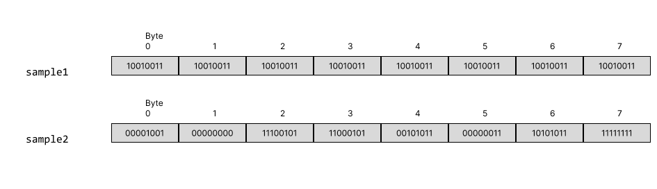
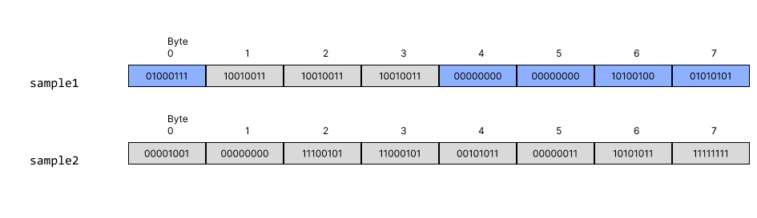
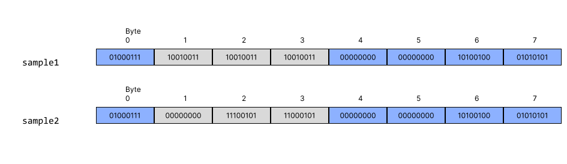
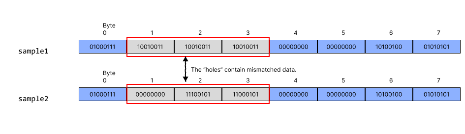

# Week 3

This week covers **structures** and **typedefs**.

## Structures

A **structure** is a collection of related variables grouped under one name.
In the C standard, structures are referred to as *aggregates*.

The `struct` keyword is used to define a structure type:

```c
// A structure for representing a playing card.
struct card {
    const char *face;
    const char *suit;
};  // Note: a semicolon is required after the closing brace.
```

The example above defines a new structure type named `card`.
The variables declared inside the braces (`face` and `suit`) are called *members*.

Since this type definition is a *declaration*, a semicolon must follow the 
closing brace.

<hr> 

### Member Types

Structures can contain members of different types.
However, a structure cannot contain a member that is an instance of its own type.
For example, the following is invalid:

```c
// Invalid: a structure cannot contain an instance of itself.
struct card {
    const char *face;
    const char *suit;
    struct card nextCard;  // Invalid
};
```

To work around this, use a pointer to the same type:

```c
// Valid: a structure can contain a pointer to its own type.
struct card {
    const char *face;
    const char *suit;
    struct card *nextCard;  // Valid
};
```

This pattern is commonly used for creating nodes in a linked list.

<hr>

### Defining Variables of Structure Types

Structure definitions alone only create a new *type* that can be used later in 
code; they do not reserve any space in memory. A structure definition is 
essentially a blueprint. To begin reserving memory for variables, use the 
following syntax:

```c
// create a new card struct
struct card myCard;

// or create an array of card structs
struct card deck[52];

// or create a pointer to a card struct
struct card *cardPtr;
```

You can also create variables of a struct during the definition of the struct 
by providing a comma-separated list of variable names after the closing 
brace of the struct but before the ending semicolon of the declaration:

```c
struct card {
    const char *face;
    const char *suit;
} myCard, deck[52], *cardPtr;
```

<hr>

### Structures without Tag Names

You can define a struct without a tag name:

```c
struct {    // NOTE: no "card" tag name
    const char *face;
    const char *suit;
} exampleCard;
```

However, without a tag name, you cannot declare additional variables of this 
type later in the program. Therefore, you *must* provide variable names *during*
the declaration to use them.

 ```c
 // This defines and declares two variables immediately.
 struct {
     int x;
     int y;
 } point1, point2;
 ```

<hr>

### Comparing Structure Objects

Structures **cannot** be compared using the operators `==` or `!=` because
structure members may not be stored in consecutive bytes of memory. Compilers
often insert padding bytes to align data members according
to their type’s alignment requirements.

These holes contain **unspecified values**, which may differ between structures
even if all members are identical. In rare cases, they might coincidentally
contain the same garbage data (for example, if memory was recently zeroed or
reused), making a bytewise comparison *appear* to return true. However, this
behavior is entirely **undefined** and cannot be relied upon.

In short, even if two structures look the same in memory, the C standard
provides **no guarantee** that comparing them byte-by-byte would produce
consistent results.

??? example "Illustration of padding and comparison"
    Suppose we have a struct defined as follows, with two variables of that type
    named <code>sample1</code> and <code>sample2</code>.
    
    ```c
    struct example {
        char c;
        int i;
    } sample1, sample2;
    ```
    
    Initially, the variables contain garbage values:
    
    
    
    We then assign values to the members of <code>sample1</code>:
    
    ```c
    sample1.c = 'G';
    sample1.i = 42069;
    ```
    
    
    
    Notice that the <code>int</code> portion begins at byte 4. This is because
    integers *must* align on a 4-byte boundary, leaving a gap in bytes 1–3.
    
    Next, we assign the same values to the members of <code>sample2</code>:
    
    ```c
    sample2.c = 'G';
    sample2.i = 42069;
    ```
    
    
    
    When comparing the two, the visible members appear equivalent, but the hidden
    padding bytes may contain different, undefined values. Even if both happen to
    contain zeros or identical garbage, it would be by coincidence, not by rule.
    The result of comparing such structs directly would therefore be **undefined**.
    
    

!!! warning
    Padding bytes are not initialized or standardized by the C language. Comparing
    structs as raw memory is undefined behavior and should never be used as a
    substitute for member-by-member comparison.

<br>
<hr>

### Using `sizeof` with Structures

The `sizeof` operator can be used to determine the amount of memory a structure occupies. However, the value returned by `sizeof` a structure often exceeds the sum of its members' sizes due to **padding and alignment**.

For example:

```c
struct example {
    char c;
    int i;
};

printf("%zu\n", sizeof(struct example));  // Likely prints 8, not 5
```

The `sizeof` value includes both the member data and any extra bytes the compiler adds to satisfy memory alignment requirements.

!!! note "Structure packing and alignment"
    When structures are stored in memory, the compiler may insert **padding bytes** 
    between members to align data according to hardware requirements. This 
    improves access performance but can waste space.
    
    You can minimize wasted space by ordering structure members from largest to 
    smallest type (for example, `double` then `int` then `char`).
    
    Some compilers provide directives like `#pragma pack` to override default 
    alignment and reduce padding. However, this is **compiler-specific** and 
    may lead to portability or performance issues. 

    It is generally recommended to **avoid using `#pragma pack`** unless you 
    have a clear and justified need, such as matching external binary data formats.

<hr>

## `typedef`

`typedef` allows you to create synonyms (or aliases) for previously defined
types.

It is commonly used to create shorter names for struct types and simplify
declarations of types like function pointers.

!!! tip
    You can use typedef to avoid retyping out struct card each time you create
    a new variable of type card.

    ```c
    typedef struct card Card;
    // you can now declare a new card struct as follows
    Card newCard;
    ```

<hr>

### Combining `typedef` with `struct` Definitions

You can combine `typedef` with a `struct` declaration to make your code cleaner 
and more readable.

!!! tip
    ```c
    // Basic struct definition
    struct card {
        const char *face;
        const char *suit;
    };
    
    // typedef struct definition
    typedef struct {
        const char *face;
        const char *suit;
    } Card;
    
    // Create an instance of each
    struct card basicCard;
    Card typeDefCard;
    ```

Using `typedef` in this way eliminates the need to repeatedly write `struct` 
when declaring variables and clearly separates the definition of the structure 
from its use as a type.

!!! warning
    When using `typedef` in this manner, do **not** include variables in the 
    struct definition itself. Doing so would cause those variables to be 
    recreated every time the alias is used.
    
    If you need to define variables along with the structure, use the standard 
    `struct` definition and then follow it with a separate `typedef` alias, as 
    shown in the previous section.

<hr>

### Creating Readable and Consistent Type Aliases

`typedef` is also used to create clear, platform-independent type names. 
This is common in system-level programming and game development, where 
developers want to ensure that integer sizes and data types are explicit and 
consistent across compilers.

For example, we can define type aliases like this:

```c
typedef uint8_t  uint8;
typedef uint16_t uint16;
typedef uint32_t uint32;
typedef uint64_t uint64;

typedef int8_t  int8;
typedef int16_t int16;
typedef int32_t int32;
typedef int64_t int64;

typedef int32 bool32;

typedef float  real32;
typedef double real64;
```

These aliases improve clarity by clearly expressing the **intended size** 
and **purpose** of each type, regardless of the compiler or platform.

!!! info
    This technique helps:
    
    * Make code **explicit** about the bit-width of each type.
    * Improve **portability**, since `stdint.h` guarantees fixed-width integer 
    types like `int32_t` and `uint16_t`.
    * Enhance **readability**, particularly in codebases where naming 
    consistency (like `real32` vs `float`) helps distinguish between conceptual 
    or mathematical types.

<hr>

